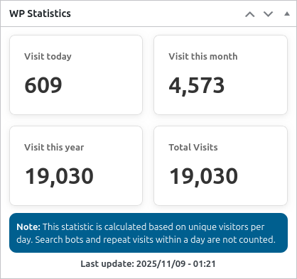

<p align="center">
    <picture>
        <source media="(prefers-color-scheme: dark)" srcset="./logo/logo-dark.png">
        <source media="(prefers-color-scheme: light)" srcset="./logo/logo-light.png">
        
    </picture>
</p>

# WP Stats

It is a simple and lightweight visit statistics system that records and displays the number of site visits without the need for plugins or heavy databases.

# How to use

Add the `stats.php` file to the function.

```php
require_once('stats.php');
```

and Copy and paste its style codes to the end of the `style.css ` file.

# Shortcodes

You can display statistics anywhere on your site template or page.

```php
[site_stats]
or
<?php echo do_shortcode('[site_stats]')?>
```

### Display type

Only shows visits today or ...

```php
[site_stats type="today"] // today, month, year, total
```

# Screenshots

<p align="center">
    <picture>
        <source media="(prefers-color-scheme: dark)" srcset="./screenshots/wp-stats.png">
        <source media="(prefers-color-scheme: light)" srcset="./screenshots/wp-stats.png">
        
    </picture>
</p>